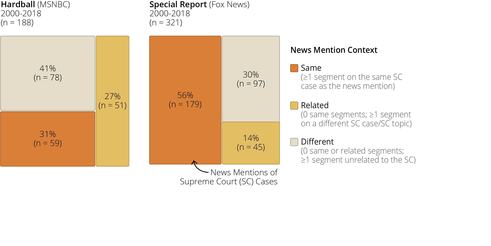
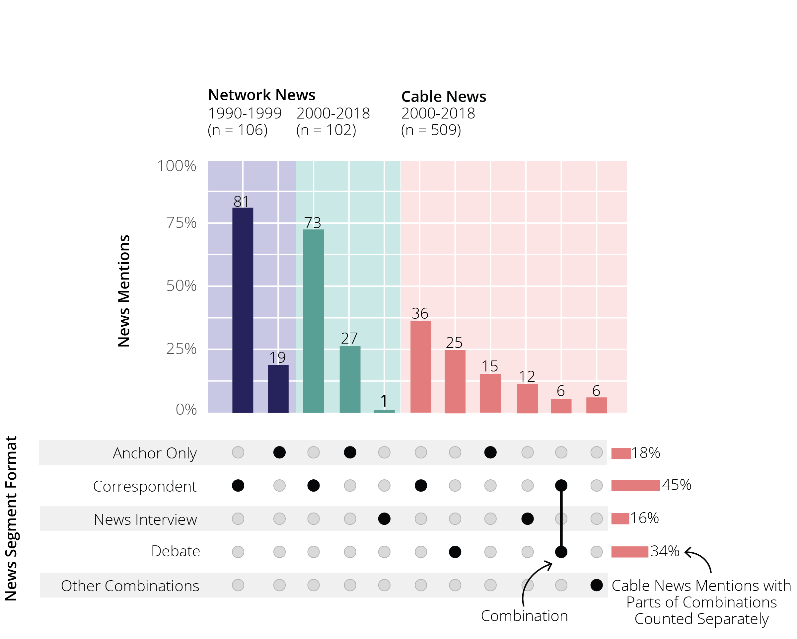
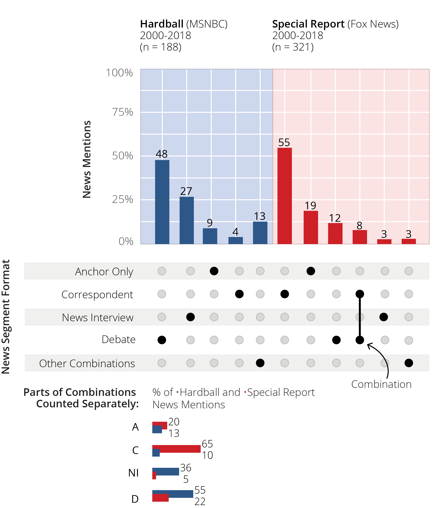
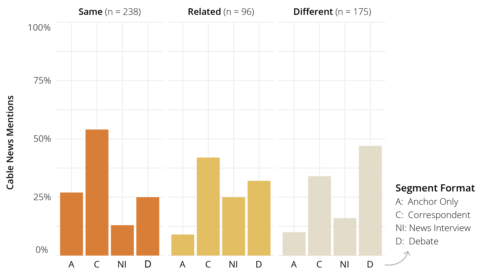
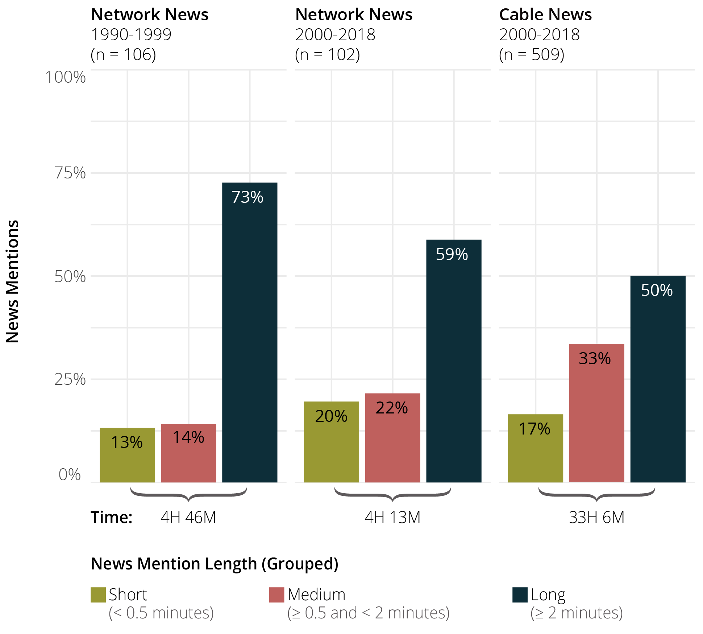
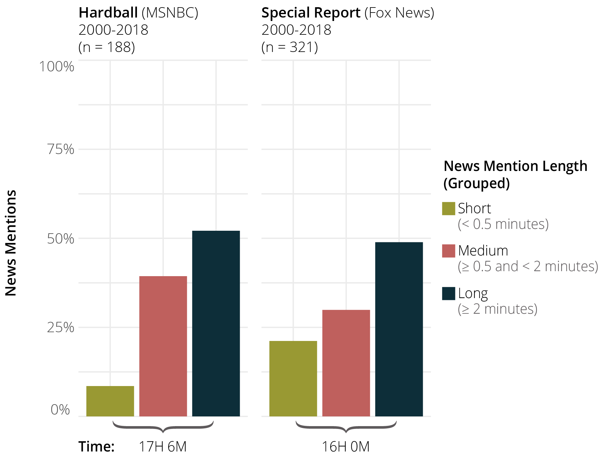
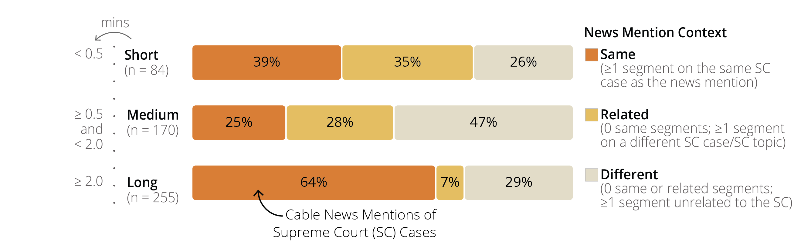
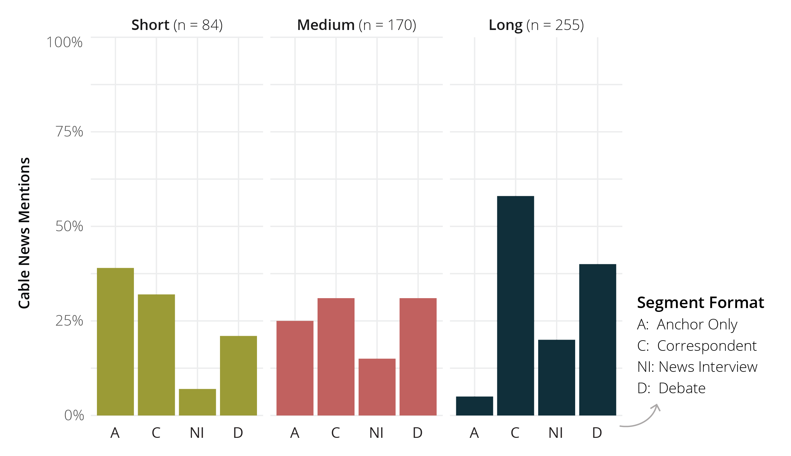
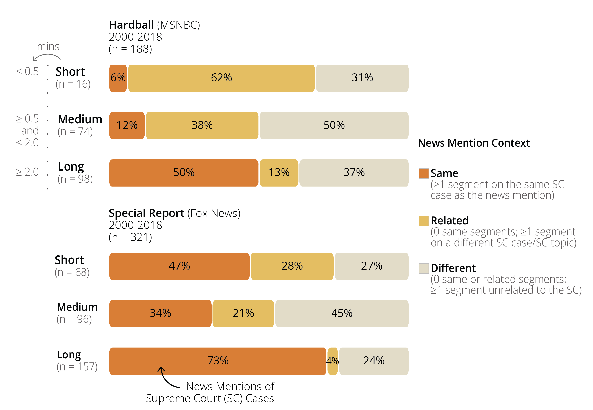

```{r setup, echo=FALSE}
#set up global R to display 3 digits (0.000)
options(digits = 3)
options(knitr.graphics.error = FALSE)

#set up knit r global
knitr::opts_chunk$set(
  comment = "#>",
  collapse = TRUE,
  warning = FALSE,
  message = FALSE,
  echo = TRUE,
  fig.width = 6,
  fig.asp = 0.618,
  out.width = "70%",
  fig.align = "center",
  dpi = 300)
```

```{r packages, echo=FALSE}
#library(colorspace)
library(ComplexUpset)
library(ggchicklet)
library(ggpubr)
library(janitor)
library(rstatix)
library(scales)
library(scico)
library(svglite)
library(tidyr)
library(tidyverse)
library(treemapify)
```

```{r main-data, echo=FALSE}
# Read the "NewsMentionSample" sheet from the local copy. Call this "mntn_raw"
mntn_raw <- read.csv("data/NewsMentionSample.csv")

```

```{r variable-transformation, echo=FALSE}
# Set factor levels and labels
IssueAreaLevels <- c(
  "Abortion", "EconomicActivity",
  "FirstAmendment",
  "SexDiscrimination"
)

CaseStageLevels <- c(
  "Cert", "PostCert", "Argument",
  "PostArgument", "Decision",
  "PostDecision"
)

ChannelTypeLevels <- c("NetworkNews", "CableNews")

TimePeriodLevels <- c("2000_2018", "1990_1999")

# Mutate columns in mntn_raw
mntn_raw$IssueArea <- factor(mntn_raw$IssueArea,
  levels = IssueAreaLevels
)

mntn_raw$CaseStage <- factor(mntn_raw$CaseStage,
  levels = CaseStageLevels
)

mntn_raw$ChannelType <- factor(mntn_raw$ChannelType,
  levels = c("NetworkNews", "CableNews")
)

mntn_raw$NewsProgram <- factor(mntn_raw$NewsProgram, levels = c("Hardball", "SpecialReport", "WorldNewsTonight"))

mntn_raw$TimePeriod <- factor(mntn_raw$TimePeriod,
  levels = TimePeriodLevels
)


mntn_raw$CaseStageCondensed <- fct_collapse(mntn_raw$CaseStage,
  "PreDecision" = c(
    "Cert", "PostCert",
    "Argument", "PostArgument"),
  "Decision" = "Decision",
  "PostDecision" = "PostDecision"
)

mntn_raw$CaseStageCondensed <- factor(mntn_raw$CaseStageCondensed, levels = c("PreDecision", "Decision", "PostDecision"))

mntn_raw$MentionContext <- factor(mntn_raw$MentionContext,
                                levels = c("1", "2", "3"))

mntn_raw$AnchorOnly <- as.numeric(as.character(mntn_raw$AnchorOnly))
mntn_raw$Correspondent <- as.numeric(as.character(mntn_raw$Correspondent))
mntn_raw$Debate <- as.numeric(as.character(mntn_raw$Debate))
mntn_raw$NewsInterview <- as.numeric(as.character(mntn_raw$NewsInterview))

mntn_raw$WordCountRAND <- as.numeric(mntn_raw$WordCountRAND)
```

```{r data-subsets, echo=FALSE}
#Create new column with collapsed channel types
df_channel_split <- mntn_raw %>%
  mutate(ChannelTypeSplit = case_when(ChannelType == "CableNews" &  TimePeriod == "2000_2018" ~ "CableNews", ChannelType == "NetworkNews" &  TimePeriod == "2000_2018" ~ "NetworkNewsPost2000", ChannelType == "NetworkNews" &  TimePeriod == "1990_1999" ~ "NetworkNewsPre2000"))

#Convert new column to factor
ChannelTypeSplitLevels <- c("NetworkNewsPre2000","NetworkNewsPost2000","CableNews")

df_channel_split$ChannelTypeSplit <- factor(df_channel_split$ChannelTypeSplit, levels = ChannelTypeSplitLevels, labels = ChannelTypeSplitLevels)
```

```{r gg-setup, echo=FALSE}
PalChannelTypeSplit <- c("CableNews" = "#e27c7c", "NetworkNewsPost2000" = "#599e94", "NetworkNewsPre2000" = "#060661")

#PalchannelTypeSplitHighlight 
PalChannelTypeSplitHighlight <- c(
  "CableNews" = after_scale(colorspace::lighten("#e27c7c", .5)), 
  "NetworkNewsPost2000" = after_scale(colorspace::lighten("#599e94", .5)), 
  "NetworkNewsPre2000" = after_scale(colorspace::lighten("#060661", .5)))

#pal_cable 
PalCable <- c(
  `Hardball` = "#2D5789",
  `SpecialReport` = "#CD2027"
)

PalIssueArea <- c(
  `Abortion` = "#315E44",
  `EconomicActivity` = "#DD6031",
  `FirstAmendment` = "#004346",
  `SexDiscrimination` = "#D3A50D"
)

PalIssueAreaLight<- c(`Abortion` = after_scale(colorspace::lighten("#315E44", .5)), `EconomicActivity` = after_scale(colorspace::lighten("#DD6031", .5)), `FirstAmendment` = after_scale(colorspace::lighten("#004346", .5)),
  `SexDiscrimination` = after_scale(colorspace::lighten("#D3A50D", .5)))

#colors for Mention Length palette from R package "PaletteWoodsHole", palette: tulips.
#pal_Context 
PalMentionContext <- c(
  `1` = "#D77D36",
  `2` = "#E4BF62",
  `3` = "#E2DBC7")

#colors for Mention Length palette from R package "scico", palette: batlow. Color for "short" mentions was adjusted for better visibility.
scico(3, palette = 'batlow')

#pal_MentionLength
PalMentionLength <- c(
  `Short` = "#FDAC9E",
  `Medium` = "#808133",
  `Long` = "#001959")
```


## Mention Context   
This compares the news mentions based on the context they were mentioned in: Same, Related, Different.  

```{r treemap-context-function}
create_treemap_context <- function(data, filter_var, filter_value, title) {
  data_filtered <- data %>% filter(!!sym(filter_var) == filter_value)
  
  treemap_plot <- data_filtered %>%
    ggplot(aes(area = n, fill = MentionContext,
               label = paste(round((n/total_count) * 100), "%\n(n =", n, ")")))  +
    geom_treemap(start = "topleft") +
    geom_treemap_text(start = "topleft",
                      colour = "black",
                      place = "centre",
                      size = 8) +
    scale_fill_manual(values = PalMentionContext) +
    theme(legend.position = "none") +
    labs(title = title)
  
  return(treemap_plot)
}
```

### Channel Type and Time Period  

```{r treemap-context-channel, out.width = "90%"}
#Create df with sample sizes for each context ("n") by channel type and time period
df_treemap_context_channel <- df_channel_split %>%
  group_by(ChannelTypeSplit, MentionContext) %>%
  summarise(n = n()) %>%
  ungroup() %>%
  group_by(ChannelTypeSplit) %>%
  mutate(total_count = sum(n))

treemap_context_pre2000_network <- create_treemap_context(df_treemap_context_channel, "ChannelTypeSplit", "NetworkNewsPre2000", "Pre-2000 Network News")

ggsave(path = "plots/NewsFormat", filename = "treemap_context_pre2000_network.svg", width = 6.3, height = 4.72)

treemap_context_post2000_network <- create_treemap_context(df_treemap_context_channel, "ChannelTypeSplit", "NetworkNewsPost2000", "Post-2000 Network News")

ggsave(path = "plots/NewsFormat", filename = "treemap_context_post2000_network.svg", width = 6.3, height = 4.72)

treemap_context_post2000_cable <- create_treemap_context(df_treemap_context_channel, "ChannelTypeSplit", "CableNews", "Cable News")

ggsave(path = "plots/NewsFormat", filename = "treemap_context_post2000_cable.svg", width = 6.3, height = 4.72)

treemap_context_pre2000_network <- treemap_context_pre2000_network + coord_fixed(ratio = 1)
treemap_context_post2000_network <- treemap_context_post2000_network + coord_fixed(ratio = 1)
treemap_context_post2000_cable <- treemap_context_post2000_cable + coord_fixed(ratio = 1)


treemap_context_channel <- ggarrange(treemap_context_pre2000_network, treemap_context_post2000_network, treemap_context_post2000_cable, nrow = 1)

treemap_context_channel
```


#### Final treemap was edited in Adobe Illustrator  

```{r treemap-context-channel-edit, echo=FALSE, out.width = "90%"}
knitr::include_graphics("AdobeEdits/treemap_context_channel_edit.png", error = F)
```


### Cable News Program  
```{r treemap-context-cable}
#Create df with sample sizes for each context ("n") by news program
df_treemap_context_cable <- df_channel_split %>%
  group_by(NewsProgram, MentionContext) %>%
  summarise(n = n()) %>%
  ungroup() %>%
  group_by(NewsProgram) %>%
  mutate(total_count = sum(n))

treemap_context_cable_hardball <- create_treemap_context(df_treemap_context_cable, "NewsProgram", "Hardball", "Hardball")

ggsave(path = "plots/NewsFormat", filename = "treemap_context_cable_hardball.svg", width = 6.3, height = 4.72)

treemap_context_cable_special_report <- create_treemap_context(df_treemap_context_cable, "NewsProgram", "SpecialReport", "Special Report")

ggsave(path = "plots/NewsFormat", filename = "treemap_context_cable_special_report.svg", width = 6.3, height = 4.72)

treemap_context_cable_hardball <- treemap_context_cable_hardball + coord_fixed(ratio = 1)

treemap_context_cable_special_report <- treemap_context_cable_special_report + coord_fixed(ratio = 1)


treemap_context_cable <- ggarrange(treemap_context_cable_hardball, treemap_context_cable_special_report, nrow = 1)

treemap_context_cable

```


#### Final treemap  was edited in Adobe Illustrator  

```{r treemap-context-cable-edit, echo=FALSE, out.width = "100%"}

```


## Segment Formats  

This compares the number of news mentions that include one of four segment formats (multiple segments could be included in one news mention): anchor-only, correspondent, debate, and news interview. News mentions were coded for the presence and absence of each format.  
```{r upset-segment-format-function}
UpsetSegmentFormats <- c("AnchorOnly", "Correspondent", "Debate", "NewsInterview")
  
prepare_data_for_upset <- function(df, SegmentFormats = UpsetSegmentFormats, isOther=FALSE) {
  # If 'Other' category is needed
  if (isOther) {
    df <- df %>%
      mutate(Other = case_when(
        AnchorOnly == 1 & Correspondent == 0 & Debate == 1 & NewsInterview == 0 ~ 1,
        AnchorOnly == 1 & Correspondent == 0 & Debate == 0 & NewsInterview == 1  ~ 1,
        AnchorOnly == 0 & Correspondent == 1 & Debate == 1 & NewsInterview == 0  ~ 1,
        AnchorOnly == 0 & Correspondent == 1 & Debate == 1 & NewsInterview == 1  ~ 1,
        AnchorOnly == 0 & Correspondent == 0 & Debate == 1 & NewsInterview == 1  ~ 1,
        AnchorOnly == 0 & Correspondent == 1 & Debate == 0 & NewsInterview == 1 ~ 1,
        TRUE ~ 0)) %>%
      
      # Update original columns based on 'Other'
      mutate(AnchorOnly = case_when(
        AnchorOnly == 1 & Other == 1  ~ 0,
        TRUE ~ as.numeric(AnchorOnly))) %>%
      mutate(Correspondent = case_when(
        Correspondent == 1 & Other == 1  ~ 0,
        TRUE ~ as.numeric(Correspondent))) %>%
      mutate(NewsInterview = case_when(
        NewsInterview == 1 & Other == 1  ~ 0,
        TRUE ~ as.numeric(NewsInterview))) %>%
      mutate(Debate = case_when(
        Debate == 1 & Other == 1  ~ 0,
        TRUE ~ as.numeric(Debate))) %>%
      relocate(Other, .after = NewsInterview)
  }
  
  SegmentFormats
  # Transform columns
  df[SegmentFormats] <- df[SegmentFormats] == 1
  
  return(df)
}

# Create plot
create_upset_plot <- function(df, SegmentFormats, aspect_ratio = 2/1) {
  
  # Create upset plot
  plot <- ComplexUpset::upset(df, SegmentFormats,
      base_annotations = list(
        'Intersection size' = 
          intersection_size(
            mapping = aes(width = 0.5),
            text_mapping = aes(
              label = paste0(round(!!get_size_mode('exclusive_intersection')/nrow(df) * 100, 1), '')
                )
            )
          + scale_y_continuous(
            labels = scales::percent_format(scale = 100 / nrow(df)),
            breaks=c(0, 25, 50, 75, 100) / 100 * nrow(df),
            limits = c(0, 100) / 100 * nrow(df)
            )
        ), 
      set_sizes = FALSE, 
      sort_sets = "descending",
      name = NULL,
      stripes = upset_stripes(
        colors = c("white", "white")),
      themes = upset_default_themes(
        axis.title = element_blank(),
        text = element_text(size = 12),
        aspect.ratio = aspect_ratio)
    )
  
  return(plot)
}
```

### Channel Type and Time Period  

```{r upset-segment-format-channel}

# Pre-2000 Network News
df_upset_format_pre2000_network <- 
  df_channel_split %>%
  filter(ChannelTypeSplit == "NetworkNewsPre2000") %>%
  prepare_data_for_upset(
  UpsetSegmentFormats,
  isOther = FALSE
)

upset_format_pre2000_network <- create_upset_plot(df_upset_format_pre2000_network, UpsetSegmentFormats, aspect_ratio = 2/1)


#ggsave(path = "plots/NewsFormat", filename = "upset_format_pre2000_network.svg", width = 6.3, height = 4.72)

# Post-2000 Network News
df_upset_format_post2000_network <- 
  df_channel_split %>%
  filter(ChannelTypeSplit == "NetworkNewsPost2000") %>%
  prepare_data_for_upset(
  UpsetSegmentFormats,
  isOther = FALSE
)

upset_format_post2000_network <- create_upset_plot(df_upset_format_post2000_network, UpsetSegmentFormats, aspect_ratio = 2/1)


#ggsave(path = "plots/NewsFormat", filename = "upset_format_post2000_network.svg", width = 6.3, height = 4.72)

# Cable News
## Without sets
df_upset_format_post2000_cable <- 
  df_channel_split %>%
  filter(ChannelTypeSplit == "CableNews") %>%
  prepare_data_for_upset(
  UpsetSegmentFormats,
  isOther = FALSE
)

upset_format_post2000_cable <- create_upset_plot(df_upset_format_post2000_cable, UpsetSegmentFormats, aspect_ratio = 1/1)


#ggsave(path = "plots/NewsFormat", filename = "upset_format_post2000_cable.svg", width = 6.3, height = 4.72)

## With sets
df_upset_format_post2000_cable_sets <- 
  df_channel_split %>%
  filter(ChannelTypeSplit == "CableNews") %>%
  prepare_data_for_upset(
  UpsetSegmentFormats,
  isOther = TRUE
)

upset_format_post2000_cable_sets <- create_upset_plot(df_upset_format_post2000_cable_sets, UpsetSegmentFormats, aspect_ratio = 2/1)

upset_format_channel <- ggarrange(upset_format_pre2000_network, upset_format_post2000_network, upset_format_post2000_cable_sets, nrow = 1)

upset_format_channel

#ggsave(path = "plots/NewsFormat", filename = "upset_format_post2000_cable_sets.svg", width = 6.3, height = 4.72)

```

#### Final UpSet plot was edited in Adobe Illustrator  

```{r upset-format-channel-edit, echo=FALSE}

```


### Cable News Program  
```{r upset-segment-format-cable}
#  Hardball
## Without sets
df_upset_format_hardball <- 
  df_channel_split %>%
  filter(NewsProgram == "SpecialReport") %>%
  prepare_data_for_upset(
  UpsetSegmentFormats,
  isOther = FALSE
)

upset_format_hardball <- create_upset_plot(df_upset_format_hardball, UpsetSegmentFormats, aspect_ratio = 2/1)

#upset_format_hardball

#ggsave(path = "plots/NewsFormat", filename = "upset_format_hardball.svg", width = 6.3, height = 4.72)


## With sets
df_upset_format_hardball_sets <- 
  df_channel_split %>%
  filter(NewsProgram == "Hardball") %>%
  prepare_data_for_upset(
  UpsetSegmentFormats,
  isOther = TRUE
)

upset_format_hardball_sets <- create_upset_plot(df_upset_format_hardball_sets, UpsetSegmentFormats, aspect_ratio = 1/1)


#ggsave(path = "plots/NewsFormat", filename = "upset_format_hardball_sets.svg", width = 6.3, height = 4.72)

# Special Report
## Without sets
df_upset_format_special_report <- 
  df_channel_split %>%
  filter(NewsProgram == "SpecialReport") %>%
  prepare_data_for_upset(
  UpsetSegmentFormats,
  isOther = FALSE
)

upset_format_special_report <- create_upset_plot(df_upset_format_special_report, UpsetSegmentFormats, aspect_ratio = 2/1)


ggsave(path = "plots/NewsFormat", filename = "upset_format_special_report.svg", width = 6.3, height = 4.72)


## With sets
df_upset_format_special_report_sets <- 
  df_channel_split %>%
  filter(NewsProgram == "SpecialReport") %>%
  prepare_data_for_upset(
  UpsetSegmentFormats,
  isOther = TRUE
)

upset_format_special_report_sets <- create_upset_plot(df_upset_format_special_report_sets, UpsetSegmentFormats, aspect_ratio = 1/1)

upset_format_cable <- ggarrange(upset_format_special_report_sets, upset_format_hardball_sets)

upset_format_cable

#ggsave(path = "plots/NewsFormat", filename = "upset_format_special_report_sets.svg", width = 6.3, height = 4.72)

```

#### Final UpSet plot was edited in Adobe Illustrator  

```{r upset-format-cable-edit, echo=FALSE}

```


### Cable News Mentions by Mention Context and Segment Format  

```{r bar-context-format-cable}
df_bar_context_format_cable <- df_channel_split %>%
  filter(ChannelTypeSplit == "CableNews") %>%
  select(MentionContext, AnchorOnly, Correspondent, Debate, NewsInterview) %>%
  gather(key = "SegmentFormat", value = "value", -MentionContext) %>%
  filter(value == 1) %>%
  group_by(MentionContext, SegmentFormat) %>%
  summarise(Count = n()) %>%
  ungroup() %>%
    mutate(SegmentFormat = fct_drop(SegmentFormat))

df_bar_context_format_cable$SegmentFormat <- factor(df_bar_context_format_cable$SegmentFormat)

# Calculate proportions
df_bar_context_format_cable <- df_bar_context_format_cable %>%
  left_join(df_channel_split %>% 
              filter(ChannelTypeSplit == "CableNews") %>%
              group_by(MentionContext) %>%
              summarise(TotalMentions = n()), by = "MentionContext") %>%
  mutate(Proportion = Count / TotalMentions)

# Plot
bar_context_format_cable <- ggplot(df_bar_context_format_cable, aes(fill = MentionContext)) +
  geom_col(aes(x = SegmentFormat, y = Proportion, group = MentionContext), position = 'dodge', color = "black") +
  facet_wrap(~ MentionContext) +
  scale_y_continuous(labels = scales::percent_format(), limits=c(0, 1), expand = c(0, 0)) +
  scale_fill_manual(values = PalMentionContext) +
  ylab("Cable News Mentions by Context")+
  theme(text = element_text(size = 12),
        legend.position = "none",
        strip.background = element_rect(fill = "white"),
        strip.text = element_text(size = 10),
        axis.ticks = element_blank(),
        axis.text = element_text(size = 10))

bar_context_format_cable

ggsave(path = "plots/NewsFormat", filename = "bar_context_format_cable.svg", width = 6.3, height = 4.72)
```

#### Final bar chart  was edited in Adobe Illustrator  

```{r bar-context-format-cable-edit, echo=FALSE}

```


## News Mention Length  
This compares the share of news mentions based on their length: short (< 30 seconds), medium (> 30 seconds & < 2 minutes), long (> 2 minutes).  

### Channel Type and Time Period  
```{r bar-mention-length-channel}
#Convert word count to seconds based on 135 words per 60 seconds/2.25 words per second (Edwards III & Howell, 2011, p. 258)
df_channel_split <- df_channel_split %>%
  mutate(MntnLengthSeconds = WordCountRAND / 2.25) %>% 
  mutate(MntnLengthSeconds = round(MntnLengthSeconds, digits = 0))

#Categorize mention length: short (shorter than 30 seconds), medium (31 seconds to 120 seconds), or long (longer than 120 seconds)
df_channel_split <- df_channel_split %>%
  mutate(MntnLengthGroup = case_when(MntnLengthSeconds < 30 ~ "short", MntnLengthSeconds >= 30 & MntnLengthSeconds < 120 ~ "medium", MntnLengthSeconds >= 120 ~ "long"))

df_channel_split$MntnLengthGroup <- factor(df_channel_split$MntnLengthGroup, levels = c("short", "medium", "long"))

bar_mntn_length_channel <- ggplot(df_channel_split, aes(fill = ChannelTypeSplit)) +
  geom_bar(aes(x = MntnLengthGroup, y = ..prop.., group = ChannelTypeSplit), position = 'dodge', color = "black") +
  facet_wrap(~ ChannelTypeSplit) +
  scale_y_continuous(labels=percent, limits=c(0, 1), expand = c(0, 0)) +
  scale_fill_manual(values = PalChannelTypeSplit) +
  xlab("News Mention Length") +
  ylab("Supreme Court News Mentions by Channel Type")+
  theme(legend.position = "none",
        strip.background = element_rect(fill = "white"),
        strip.text = element_text(size = 10),
        axis.ticks = element_blank(),
        axis.text = element_text(size = 10))

bar_mntn_length_channel

ggsave(path = "plots/NewsFormat", filename = "bar_mntn_length_channel.svg",   width = 6.3, height = 4.72)
```

#### Final bar chart  was edited in Adobe Illustrator  

```{r bar-mntn-length-channel-edit, echo=FALSE}

```

### Cable News Programs  
```{r bar-mention-length-cable}
bar_mntn_length_cable <- df_channel_split %>%
  filter(ChannelTypeSplit == "CableNews") %>%
  ggplot(aes(fill = NewsProgram)) +
  geom_bar(aes(x = MntnLengthGroup, y = ..prop.., group = NewsProgram), position = 'dodge', color = "black") +
  facet_wrap(~ NewsProgram) +
  scale_y_continuous(labels=percent, limits=c(0, 1), expand = c(0, 0)) +
  scale_fill_manual(values = PalCable) +
  xlab("News Mention Length") +
  ylab("Supreme Court News Mentions by News Program")+
  theme(legend.position = "none",
        strip.background = element_rect(fill = "white"),
        strip.text = element_text(size = 10),
        axis.ticks = element_blank(),
        axis.text = element_text(size = 10))

bar_mntn_length_cable

ggsave(path = "plots/NewsFormat", filename = "bar_mntn_length_cabel.svg",   width = 6.3, height = 4.72)
```

#### Final bar chart  was edited in Adobe Illustrator  

```{r bar-mntn-length-cable-edit, echo=FALSE}

```


### Cable News Mentions by Length and Context  

```{r chicklet_mention_length_context-cable}
chicklet_mention_length_context_cable <- df_channel_split %>%
  filter(ChannelTypeSplit == "CableNews") %>%
  group_by(MntnLengthGroup, MentionContext) %>% 
  tally() %>%
  group_by(MntnLengthGroup) %>% 
  mutate(
    n = n/sum(n)) %>%
  ungroup() %>%
   ggplot(aes(fct_rev(MntnLengthGroup), n, fill = MentionContext, label = paste0(round(n*100, digits = 0), "%")))  +
  geom_chicklet(width = 0.3) +
    geom_text(size = 4, position = position_stack(vjust = 0.5, reverse = TRUE)) +
  scale_y_continuous(labels=percent, limits=c(0, 1), expand = c(0, 0)
  )  +
  scale_fill_manual(values = PalMentionContext) +
  coord_flip() +
  theme_minimal()

chicklet_mention_length_context_cable

ggsave(path = "plots/NewsFormat", filename = "chicklet_mention_length_context_cable.svg",   width = 6.3, height = 4.72)
```

#### Final chicklet was edited in Adobe Illustrator  

```{r chicklet_mention_length_context-cable-edit, echo=FALSE, out.width = "90%"}

```


### Cable News Mentions by Length and Segment Format  

```{r bar_length_format_cable}
bar_length_format_cable <- df_channel_split %>%
    pivot_longer(cols = AnchorOnly:NewsInterview,
               names_to = "SegmentFormat",
               values_to = "value") %>%
  filter(ChannelTypeSplit == "CableNews", value == 1) %>%
  ggplot() +
  geom_bar(aes(x = SegmentFormat, y = ..prop.., group = MntnLengthGroup), position = 'dodge', color = "black") +
  facet_wrap(~ MntnLengthGroup) +
  scale_y_continuous(labels=percent, limits=c(0, 1), expand = c(0, 0)) +
  scale_fill_manual(values = PalMentionLength) +
  xlab("News Mention Length") +
  ylab("Cable News Mentions") +
  theme(text = element_text(size = 10),
        legend.position = "none",
        strip.background = element_rect(fill = "white"),
        strip.text = element_text(size = 10),
        axis.ticks = element_blank(),
        axis.text = element_text(size = 10))

bar_length_format_cable

ggsave(path = "plots/NewsFormat", filename = "bar_length_format_cable.svg",   width = 6.3, height = 4.72)

```

#### Final bar chart was edited in Adobe Illustrator  

```{r bar-length-format-cable-edit, echo=FALSE, out.width = "90%"}

```


### Cable News Mentions by  Length and Context  

```{r chicklet-context-length-cable}
#Cable shows by mention length and context
chicklet_context_length_cable <- df_channel_split %>%
  filter(ChannelTypeSplit == "CableNews") %>%
  group_by(NewsProgram, MntnLengthGroup, MentionContext) %>% 
  tally() %>%
  group_by(NewsProgram, MntnLengthGroup) %>% 
  mutate(
    n = n/sum(n)) %>%
  ungroup() %>%
   ggplot(aes(fct_rev(MntnLengthGroup), n, fill = MentionContext,  label = paste0(round(n*100, digits = 0), "%"))) +
  geom_chicklet(width = 0.3) +
    geom_text(size = 4, position = position_stack(vjust = 0.5, reverse = TRUE)) +
  scale_y_continuous(labels=percent, limits=c(0, 1), expand = c(0, 0)
  )  +
  scale_fill_manual(values = PalMentionContext) +
  facet_grid(rows = vars(NewsProgram)) +
  coord_flip() +
  theme_minimal()

chicklet_context_length_cable

ggsave(path = "plots/NewsFormat", filename = "chicklet_context_length_cable.svg",   width = 6.3, height = 4.72)
```


#### Final chicklet was edited in Adobe Illustrator  

```{r chicklet-context-length-cable-edit, echo=FALSE, out.width = "90%"}

```
