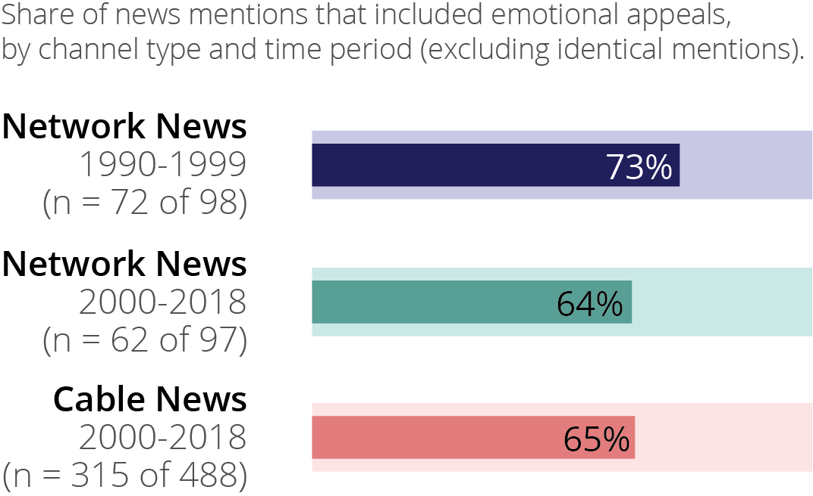
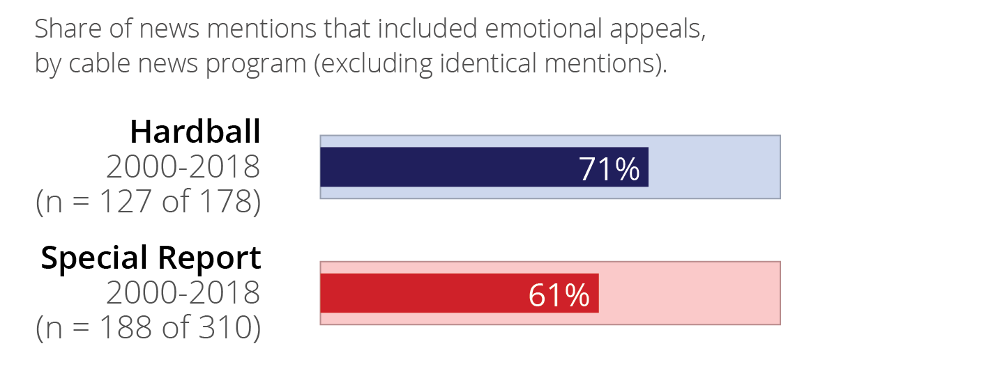
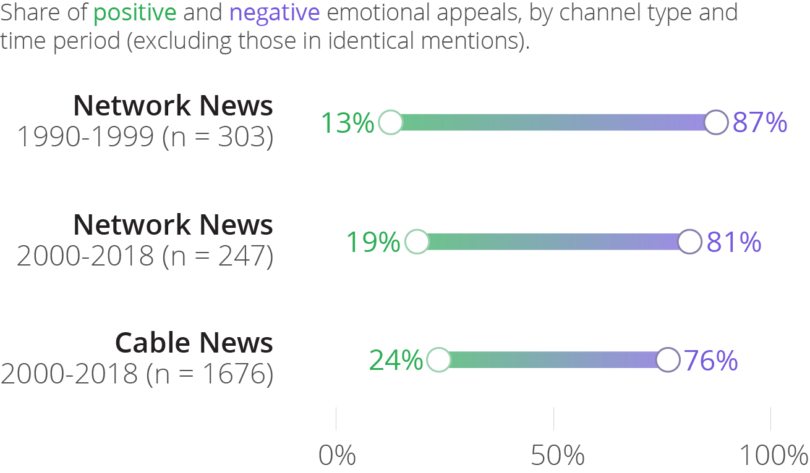
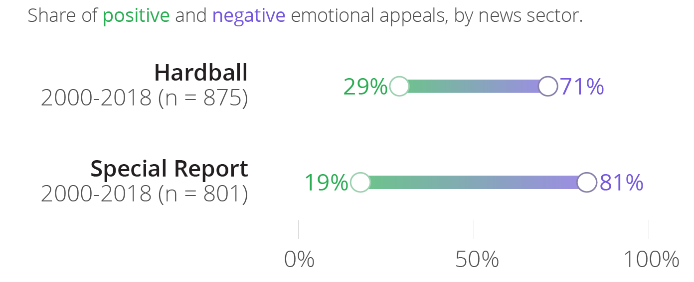
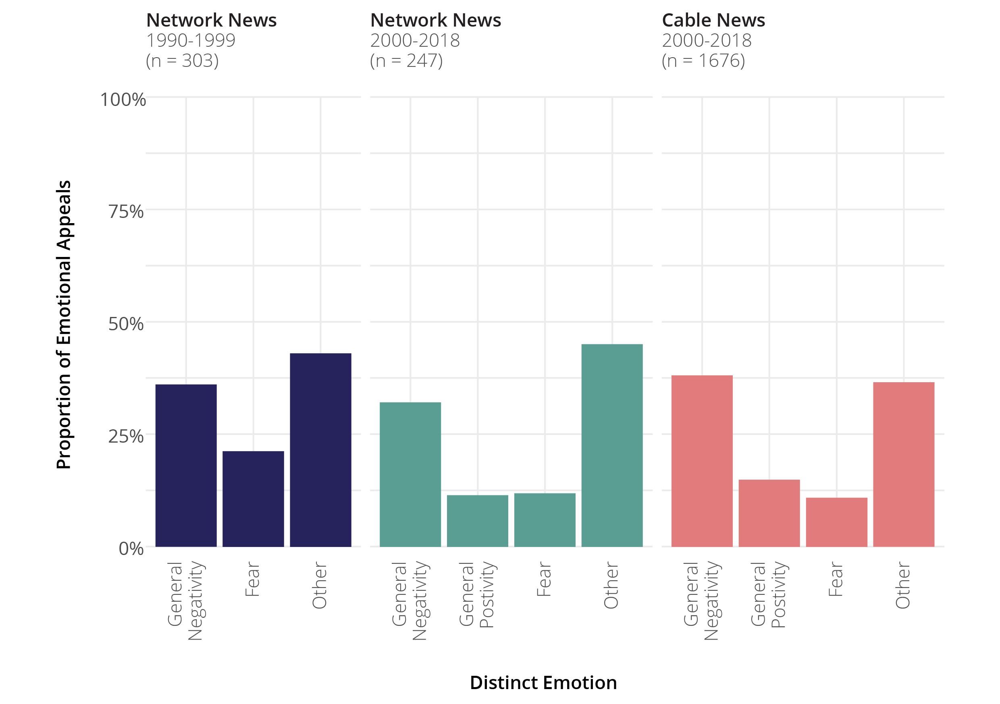
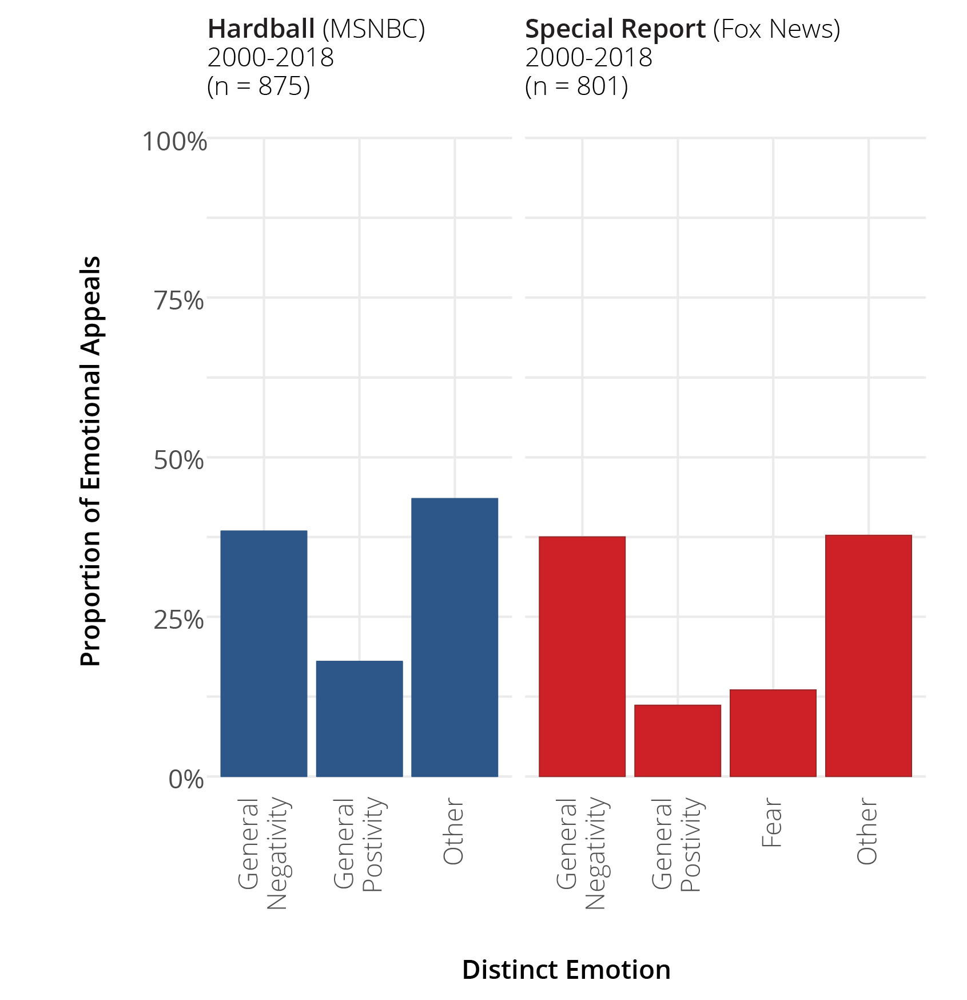

```{r setup, echo = FALSE}
#set up global R to display 3 digits (0.000)
options(digits = 3)
options(knitr.graphics.error = FALSE)

#set up knit r global
knitr::opts_chunk$set(
  comment = "#>",
  collapse = TRUE,
  warning = FALSE,
  message = FALSE,
  echo = TRUE,
  fig.width = 6,
  fig.asp = 0.618,
  out.width = "70%",
  fig.align = "center",
  dpi = 300)
```

```{r packages, echo = FALSE}
library(datawizard)
library(janitor)
library(magrittr)
library(tidyverse)
```

```{r main-data, echo = FALSE}
mntn_emo <- read.csv("data/NewsEmotion.csv")
```

```{r variable-transformation, echo = FALSE}
# Set factor levels and labels
TimePeriodLevels <- c("2000_2018", "1990_1999")

# Mutate columns in mntn_emo
mntn_emo$ChannelType <- factor(mntn_emo$ChannelType,
  levels = c("NetworkNews", "CableNews")
)

mntn_emo$IssueArea <- factor(mntn_emo$IssueArea,
  levels = c("Abortion", "EconomicActivity", "FirstAmendment","Sex Discrimination"))

mntn_emo$NewsProgram <- factor(mntn_emo$NewsProgram, levels = c("Hardball", "SpecialReport", "WorldNewsTonight"))

mntn_emo$TimePeriod <- factor(mntn_emo$TimePeriod,
  levels = TimePeriodLevels
)

mntn_emo$MultiMentionType <- as.factor(mntn_emo$MultiMentionType)

mntn_emo$AnchorOnly <- as.numeric(as.character(mntn_emo$AnchorOnly))
mntn_emo$Correspondent <- as.numeric(as.character(mntn_emo$Correspondent))
mntn_emo$Debate<- as.numeric(as.character(mntn_emo$Debate))
mntn_emo$NewsInterview <- as.numeric(as.character(mntn_emo$NewsInterview))

mntn_emo <- mntn_emo %>%
  mutate(ChannelTypeSplit = case_when(ChannelType == "CableNews" &  TimePeriod == "2000_2018" ~ "CableNews", ChannelType == "NetworkNews" &  TimePeriod == "2000_2018" ~ "NetworkNewsPost2000", ChannelType == "NetworkNews" &  TimePeriod == "1990_1999" ~ "NetworkNewsPre2000"))

mntn_emo$ChannelTypeSplit <- factor(mntn_emo$ChannelTypeSplit, levels = c("NetworkNewsPre2000", "NetworkNewsPost2000", "CableNews"))

#Robustness set with Identical news mentions included only once
# Create a new dataframe that only includes entries with "MultiMentionMentionType" == "Identical"
mntn_emo_Identical <- mntn_emo[mntn_emo$MultiMentionType == "Identical",]

# Use the unique function to only keep the first instance of each "TranscriptID" for Identicals
mntn_emo_Identical <- mntn_emo_Identical[!duplicated(mntn_emo_Identical$TranscriptID),]

# Create a new dataframe that only includes entries with "MultiMentionMentionType" != "Identical"
mntn_emo_non_Identical <- mntn_emo[mntn_emo$MultiMentionType != "Identical",]

# Concatenate the filtered dataframes
mntn_emo_robust <- rbind(mntn_emo_non_Identical, mntn_emo_Identical)

```

## Presence of Emotional Appeals 

### Channel Type and Time Period

```{r bar-emo-present-channel}
create_bar_emo_present <- function(data, group_var) {
  
  # Group data and calculate percentages
  df_grouped <- data %>%
    group_by(!!sym(group_var), EmotionPresent) %>% 
    summarise(count = n()) %>% 
    mutate(perc = count/sum(count)) %>%
    ungroup()
  
  # Define theme
  theme_emo_horizontal <- theme_void(base_size = 14) %+replace%
    theme(axis.text.y = element_text(color = "black")) 

  
# Create plot
  plot <- ggplot(df_grouped, aes(x = fct_rev(factor(!!sym(group_var))), y = perc, fill = factor(EmotionPresent))) +
    geom_bar(stat="identity", width = 0.7) +
    geom_text(data = subset(df_grouped, EmotionPresent == 1),
              aes(label = scales::percent(perc)),
              position = position_stack(vjust = 0.5),
              color = "white") +
    scale_y_continuous(labels = scales::percent_format()) +
    labs(x = group_var, y = NULL, fill = "EmotionPresent") +
    theme_emo_horizontal +
    coord_flip()

  return(plot)
}

# Plot by Channel Type
bar_emo_present_channel <- create_bar_emo_present(mntn_emo_robust, "ChannelTypeSplit") +
  labs(subtitle = "Share of news mentions that included emotional appeals,\nby channel type and time period (excluding identical mentions)")

bar_emo_present_channel

##Save plot
ggsave(path = "plots/NewsPresentation", filename = "bar_emo_present_channel.svg", width = 6.3, height = 4.72)

```

#### Final dumbbell chart was edited in Adobe Illustrator

```{r bar-emo-present-channel-edit}

```


### Cable News Program

```{r bar-emo-present-cable}
# Plot by Cable News Program
bar_emo_present_cable <- mntn_emo_robust %>% 
  filter(ChannelTypeSplit == "CableNews") %>%
  create_bar_emo_present(., "NewsProgram")  +
  labs(subtitle = "Share of news mentions that included emotional appeals,\nby cable news program (excluding identical mentions)")

bar_emo_present_cable

ggsave(path = "plots/NewsPresentation", filename = "bar_emo_present_cable.svg", width = 6.3, height = 4.72)

```

#### Final dumbbell chart was edited in Adobe Illustrator

```{r bar-emo-present-cable-edit}

```


## Type of Emotional Appeals
This compares the share of positive/negative emotional appeals included in the news mentions as well as the distinct emotions featured most frequently.

### Channel Type and Time Period
```{r dumbell-emo-type-channel}
  create_dumbbell_chart <- function(data, group_var, filter_vars = NULL, filter_values = NULL) {
  
  # Optional filtering
  if (!is.null(filter_vars)) {
    data <- data %>% filter(!!sym(filter_vars) %in% filter_values)
  }
  
  # Format data
  df_grouped <- data %>%
    filter(EmotionPresent == "1") %>%
    select(!!sym(group_var), NegativeEmotion, PositiveEmotion) %>% 
    group_by(!!sym(group_var)) %>%
    summarise_all(.funs = sum, na.rm = TRUE) %>%
    mutate(NegativeEmotionPerc = NegativeEmotion / (NegativeEmotion + PositiveEmotion),
           PositiveEmotionPerc = PositiveEmotion / (NegativeEmotion + PositiveEmotion)) %>%
    mutate(NegativeEmotionPerc = round(NegativeEmotionPerc, 4),
           PositiveEmotionPerc = round(PositiveEmotionPerc, 4)) %>%
    ungroup() %>%
    select(!!sym(group_var), NegativeEmotionPerc, PositiveEmotionPerc) %>%
    pivot_longer(cols = NegativeEmotionPerc:PositiveEmotionPerc,
                 names_to = "EmotionPrec",
                 values_to = "perc")
  
  # Plot
  plot <- df_grouped %>%
    ggplot(aes(x = perc, y = fct_rev(factor(!!sym(group_var))))) +
    geom_line(aes(group = !!sym(group_var)), size = 3) +
    geom_point(aes(color = EmotionPrec), size = 4) +
    scale_x_continuous(labels = scales::percent_format(), breaks = c(0, .25, .50, .75, 1), limits = c(0, 1)) +
    theme_minimal()
  
  return(plot)
}

# Using the function
dumbbell_emo_type_channel <- create_dumbbell_chart(mntn_emo_robust, "ChannelTypeSplit")

dumbbell_emo_type_channel

ggsave(path = "plots/NewsPresentation", filename = "dumbbell_emo_type_channel.svg", width = 6.3, height = 4.72)

```

#### Final dumbbell chart was edited in Adobe Illustrator

```{r dumbbell-emo-type-channel-edit}

```


### Cable News Program

```{r dumbell-emo-type-cable}

dumbbell_emo_type_cable <- create_dumbbell_chart(mntn_emo_robust, "NewsProgram", "ChannelTypeSplit", "CableNews")

dumbbell_emo_type_cable

ggsave(path = "plots/NewsPresentation", filename = "dumbbell_emo_type_cable.svg", width = 6.3, height = 4.72)

```

#### Final dumbbell chart was edited in Adobe Illustrator

```{r dumbbell-emo-type-cable-edit}

```

## Most Frequently Used Emotions

### Channel Type and Time Period

```{r bar-distinct-emo-channel}
create_discrete_emotion_bar_chart <- function(data, group_var, filter_var = NULL, filter_value = NULL) {
  
# Optional filtering
  if (!is.null(filter_var)) {
    data <- data %>% filter(!!sym(filter_var) == filter_value)
  }
  
  # Process data
df_grouped <- data %>%
    select(!!sym(group_var), NegativeEmotionAlarming:PositiveEmotionThing) %>%
    group_by(!!sym(group_var)) %>%
    summarise(across(everything(), list(sum))) %>%
    pivot_longer(cols = NegativeEmotionAlarming_1:PositiveEmotionThing_1,
                 names_to = "EmotionTypeSpec",
                 values_to = "n") %>%
    mutate(OriginalEmotionTypeSpec = EmotionTypeSpec,
           EmotionTypeSpec = case_when(
             !!sym(group_var) == "NetworkNewsPre2000" & n < 30 ~ "Other",
             !!sym(group_var) == "NetworkNewsPost2000" & n < 25 ~ "Other",
             !!sym(group_var) == "CableNews" & n < 167 ~ "Other",
             !!sym(group_var) == "Hardball" & n < 80 ~ "Other",
             !!sym(group_var) == "SpecialReport" & n < 80 ~ "Other",
             TRUE ~ EmotionTypeSpec)) %>%
    group_by(!!sym(group_var), EmotionTypeSpec, OriginalEmotionTypeSpec) %>%
    summarise(n = sum(n)) %>%
    mutate(EmotionGroup = case_when(
      EmotionTypeSpec != "Other" & str_detect(EmotionTypeSpec, "Negative") ~ "Negative",
      EmotionTypeSpec != "Other" ~ "Positive",
      EmotionTypeSpec == "Other" & str_detect(OriginalEmotionTypeSpec, "Negative") ~ "Negative",
      TRUE ~ "Positive"
    ))
  
  # Order the factor levels based on the entire dataset
  df_grouped$EmotionTypeSpec <- factor(df_grouped$EmotionTypeSpec, levels = unique(df_grouped$EmotionTypeSpec[order(-df_grouped$n)]))
  
  # Compute proportions
  df_grouped <- df_grouped %>%
    group_by(!!sym(group_var), EmotionTypeSpec) %>%
    summarise(n = sum(n)) %>%
    mutate(prop = n / sum(n))
  
  # Bar chart
  plot <- ggplot(df_grouped, aes(fill = !!sym(group_var))) +
    geom_col(aes(x = EmotionTypeSpec, y = prop, group = !!sym(group_var)), position = 'dodge', color = "black") +
    facet_wrap(as.formula(paste("~", group_var))) +
    theme_minimal() +
    theme(axis.text.x = element_text(angle = 45, hjust = 1),
          legend.position = "none") +
    scale_y_continuous(labels = scales::percent, expand = c(0, 0), limits = c(0, 1)) +
    labs(y = paste("Proportion of Emotional Appeals by", group_var), x = "Distinct Emotion")
  
  
  return(plot)
}

# Using the function
bar_discrete_emo_channel <- create_discrete_emotion_bar_chart(mntn_emo_robust, "ChannelTypeSplit", NULL, NULL)

bar_discrete_emo_channel

ggsave(path = "plots/NewsPresentation", filename = "bar_distinct_emo_channel.svg", width = 200, height = 150, units = "mm")
```

#### Final bar chart was edited in Adobe Illustrator

```{r bar-distinct-emo-channel-edit}

```

### Cable News Program

```{r bar-distinct-emo-cable}
bar_discrete_emo_cable <- create_discrete_emotion_bar_chart(mntn_emo_robust, "NewsProgram", "ChannelTypeSplit", "CableNews")

bar_discrete_emo_cable

ggsave(path = "plots/NewsPresentation", filename = "bar_distinct_emo_cable.svg", width = 200, height = 150, units = "mm")
```


#### Final bar chart was edited in Adobe Illustrator

```{r bar-distinct-emo-cable-edit}

```